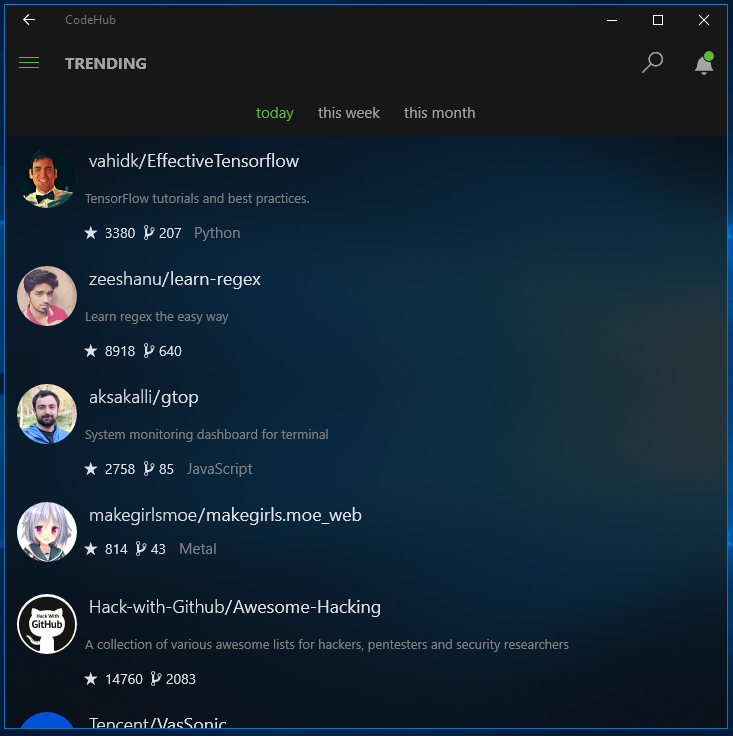

# CodeHub

CodeHub is a Universal Windows GitHub client that helps you keep up with the open source world.

## Features
* Trending repositories
* News Feed
* View code (with syntax highlighting), issues and comments. 
* Create Issues
* Comment on Issues
* Choose from 9 different syntax highlighting styles
* Search repositories, users, issues and code
* Star, Watch and Fork repositories
* Follow users

## Screenshots

|             |               |                   |
| ----------- |:-------------:| :----------------:|
|  |   |  |

## Contributing
Do you want to contribute? Here are our [contribution guidelines](CONTRIBUTING.md).

## Setting up the project 
* [Register](https://github.com/settings/developers) your OAuth application and paste your key and secret in the `app.config` file in the root of the project.

## Troubleshooting

### I Can't Find My Organization

CodeHub can see all organizations *if they are granted access*. GitHub, by default, disables [third-party access](https://help.github.com/articles/about-third-party-application-restrictions/) for new organizations. Because of this, CodeHub has no knowledge that those organizations even exist. GitHub keeps that information from the app. There are several ways to correct this. If you own the organization follow [these instructions](https://help.github.com/articles/enabling-third-party-application-restrictions-for-your-organization/). If you do not own the organization you can request access for CodeHub by following [these instructions](https://help.github.com/articles/requesting-organization-approval-for-third-party-applications/).

## Dependencies
I thank the makers of these libraries
* [Octokit](https://github.com/octokit/octokit.net)
* [UICompositionAnimations](https://github.com/Sergio0694/UICompositionAnimations)
* [MVVM Light](https://www.nuget.org/packages/MvvmLightLibs/)
* [UWP Community Toolkit](https://github.com/Microsoft/UWPCommunityToolkit)
* [MarkdownSharp.UWP](https://www.nuget.org/packages/MarkdownSharp.UWP/)
* [HTML Agility Pack](https://www.nuget.org/packages/HtmlAgilityPack)
* [JetBrains ReSharper Annotations](https://www.nuget.org/packages/JetBrains.Annotations)
* [Lumia Imaging SDK UWP](https://www.nuget.org/packages/LumiaImagingSDK.UWP/)
* [LocalNotifications](https://github.com/RavinduL/LocalNotifications)

## Gitter chat
* https://gitter.im/CodehubUWP/Bugs
* https://gitter.im/CodehubUWP/FeatureRequests
